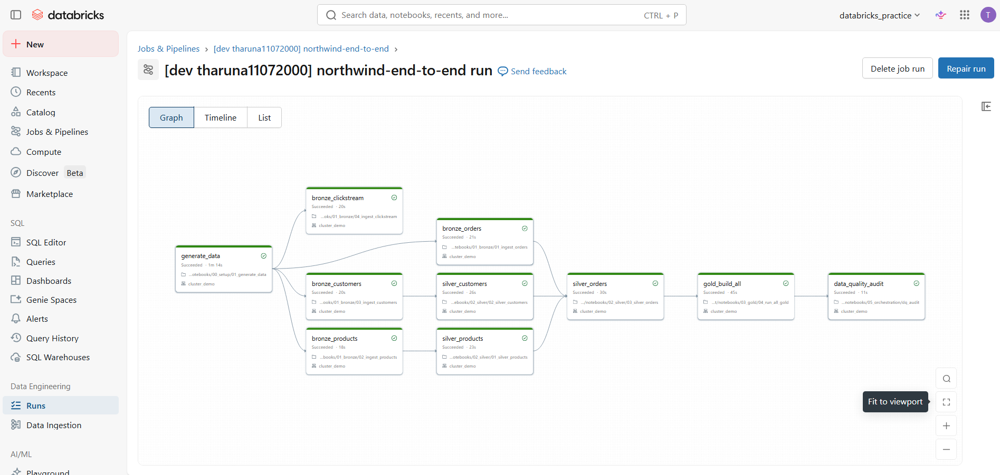
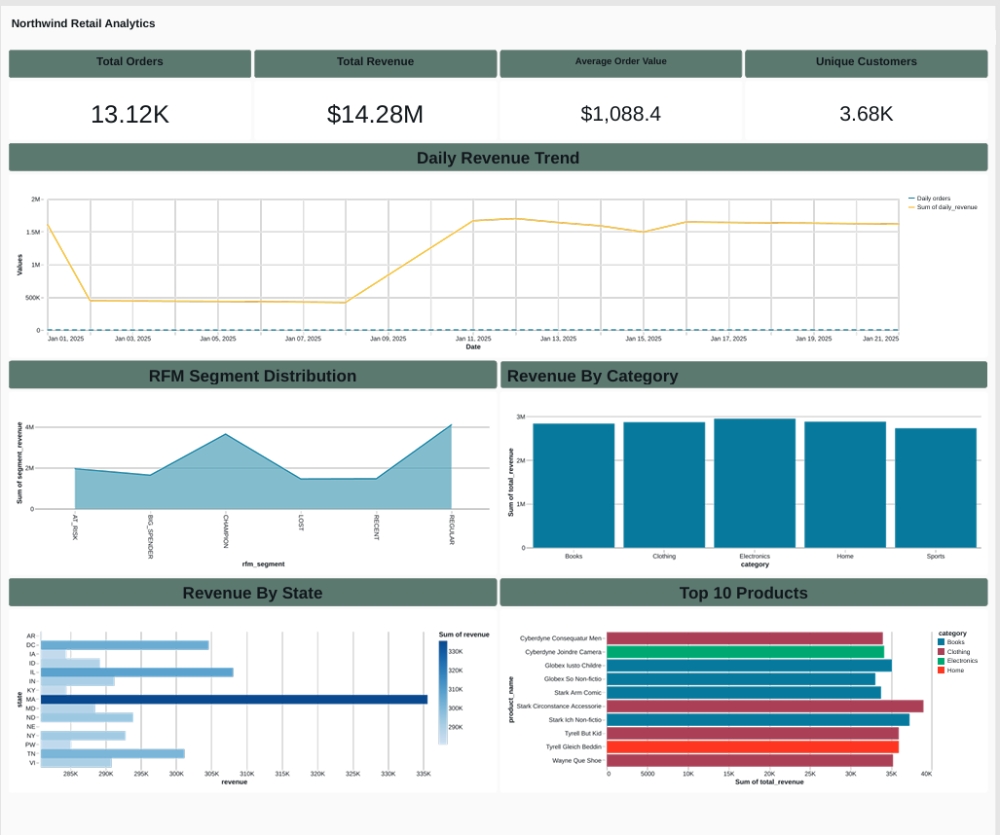

# Northwind Lakehouse — Production-Grade Databricks Data Engineering Project

An end-to-end lakehouse on Databricks (GCP) implementing the medallion architecture
with both **manual PySpark** and **Delta Live Tables**, governed by Unity Catalog,
orchestrated as a **Databricks Asset Bundle**, and visualized in Databricks SQL.



## What This Project Demonstrates

| Capability | Implementation |
|---|---|
| Incremental file ingestion | Auto Loader with schema evolution and `_rescued_data` |
| Slowly Changing Dimensions (Type 2) | Two-step MERGE pattern + DLT `apply_changes` for comparison |
| Star-schema modeling | `fact_sales` with point-in-time (temporal) joins to dimensions |
| Data quality | Delta CHECK constraints, DLT expectations, quarantine table, end-of-pipeline audit |
| PII handling | SHA-256 hashing + restricted vault table with column masks |
| Performance | Liquid Clustering, Photon, query profile-driven tuning |
| Governance | Unity Catalog grants, masks, tags, auto-lineage |
| Orchestration | Databricks Asset Bundles with multi-environment targets |
| Cost awareness | Documented GCP capacity issue and mitigation strategy |

## Architecture

```
Source Systems (simulated)
    │
    ▼ Auto Loader (incremental, schema-aware)
┌─────────┐
│ BRONZE  │  Raw, append-only, lineage-tagged
└────┬────┘
     │ MERGE / DLT apply_changes
     ▼
┌─────────┐
│ SILVER  │  Cleansed, deduplicated, validated, PII-hashed
│         │  - dim_customers (SCD Type 2)
│         │  - fact_orders (deduped, quality-gated)
│         │  - fact_order_items (exploded line items)
│         │  - products (incremental MERGE)
│         │  - pii_lookup (vault with column masks)
└────┬────┘
     │ Temporal joins + aggregation
     ▼
┌─────────┐
│  GOLD   │  Business-ready star schema
│         │  - fact_sales (point-in-time dimension joins)
│         │  - dim_date
│         │  - daily_revenue_by_category
│         │  - customer_lifetime_value (RFM)
│         │  - product_performance
└────┬────┘
     │
     ▼
Databricks SQL Dashboard
```

## Tech Stack

PySpark · Delta Lake · Unity Catalog · Auto Loader · Delta Live Tables ·
Databricks SQL · Databricks Asset Bundles · Databricks Workflows ·
GCP Cloud Storage · Python · GitHub

## The Dashboard



A 6-widget executive dashboard built on Databricks SQL, served directly off
the Gold layer with sub-second query latency thanks to Liquid Clustering on
`fact_sales`.

## Key Engineering Decisions

### Why both Manual MERGE and DLT for Silver?

The project implements two parallel Silver pipelines to demonstrate the tradeoffs:

| Aspect | Manual (PySpark) | Delta Live Tables |
|---|---|---|
| Code volume | ~600 lines | ~150 lines |
| Idempotency | Hash-based MERGE pattern | Built-in |
| SCD2 | Two-step MERGE | `apply_changes` declarative |
| Streaming dedup | Window-based (full data) | Requires `dropDuplicatesWithinWatermark` |
| Monitoring UI | None (custom code) | Auto-generated DAG + DQ metrics |

The manual pipeline retains 13,121 valid orders after dedup. The DLT pipeline
retains 13,245 because streaming requires watermarked dedup, not row-number
ranking. **This is a real tradeoff documented in the project, not a bug.**

### Why a PII vault with column masks instead of just hashing?

Hashing alone is irreversible — useful when you never need cleartext. But
customer support legitimately needs to look up a customer's real email when
investigating a complaint. The vault pattern handles both:

- **Main tables** store only SHA-256 hashes (safe by default)
- **`pii_lookup` table** stores cleartext, protected by column masks that
  reveal real values **only to members of `northwind_pii_readers`**

A leak of the main tables exposes nothing personally identifiable. The vault
table itself is masked per-user — even a SELECT on it returns `joh.****@****`
unless the caller has elevated group membership.

### Why temporal joins matter

`fact_sales` joins customer attributes **as they were on the order date**,
not as they are today. For customer `CUST_000114`:

| Order Date | Tier at Order |
|---|---|
| 2025-01-01 | PLATINUM |
| 2025-01-16 | BRONZE (downgraded Jan 15) |

Without SCD2 + temporal joins, both rows would show `BRONZE`, silently
corrupting any report asking "revenue from PLATINUM customers in January."
This is the canonical dimensional modeling bug — and a top-5 interview question.

## Project Structure

```
northwind-lakehouse-project/
├── databricks.yml              # Asset Bundle definition (jobs, vars, targets)
├── src/northwind/
│   ├── generators/             # Synthetic data generators (Phase 1)
│   ├── bronze/                 # Auto Loader ingestion (Phase 2)
│   ├── silver/                 # Manual MERGE pipelines (Phase 3A–3C)
│   ├── dlt/                    # Delta Live Tables variant (Phase 3D)
│   └── gold/                   # Star schema + aggregates (Phase 4)
├── notebooks/
│   ├── 00_setup/               # Schema/volume bootstrap + data generation
│   ├── 01_bronze/              # Per-source Bronze ingestion runners
│   ├── 02_silver/              # Per-table Silver runners
│   ├── 03_gold/                # Gold build runner
│   ├── 04_governance/          # UC grants, masks, tags
│   └── 05_orchestration/       # DQ audit
└── README.md
```

## Running the Project

1. Provision a Databricks workspace with Unity Catalog enabled
2. Create a catalog (default: `dbs_main_catalog`)
3. Run notebooks/00_setup/01_generate_data with `day_offset=0` through `21`
4. Deploy the bundle:
```bash
   databricks bundle validate
   databricks bundle deploy --target dev
   databricks bundle run northwind_end_to_end --target dev
```

## Lessons Learned (Operational)

- **Schema inference is fragile.** Bronze JSONL columns were inferred as
  STRING despite being nested JSON. Solution: explicit `from_json` in Silver
  with declared schemas. In production, lock schemas via `cloudFiles.schemaHints`.

- **GCP capacity errors are real.** Hit `GCP_INSUFFICIENT_CAPACITY` during job
  cluster provisioning in `us-central1-a`. Mitigated with all-purpose cluster
  fallback for dev; production should use serverless or multi-zone autoscaling
  (`zone_id: HA`).

- **Python caching in Databricks notebooks is invisible.** A MERGE pattern that
  reported `10000 rows updated` on every re-run looked broken until
  `dbutils.library.restartPython()` cleared the cached module — the new
  conditional MERGE was already correct.

- **Synthetic data generators need deterministic identity.** First customer
  generator produced 100% address-change rate because `Faker` instances
  don't share Python's `random.seed`. Fix: hash-derived identity fields keyed
  by `(customer_id, version)`.

## Known Limitations

- Row-level security implemented but not applied to `fact_sales` to avoid
  blocking dashboard access for the current user
- DLT pipeline does not deduplicate orders (streaming would require
  `dropDuplicatesWithinWatermark`); manual pipeline does
- Job schedule is paused — unpause via `pause_status: UNPAUSED` in `databricks.yml`

## Future Enhancements


- Wire up GitHub Actions for CI/CD on bundle deploy
- Migrate from all-purpose cluster to serverless compute for cost savings
- Add Lakehouse Monitoring on Gold tables for drift detection

---

*Built as a hands-on portfolio project to demonstrate Databricks Data Engineering proficiency.*
